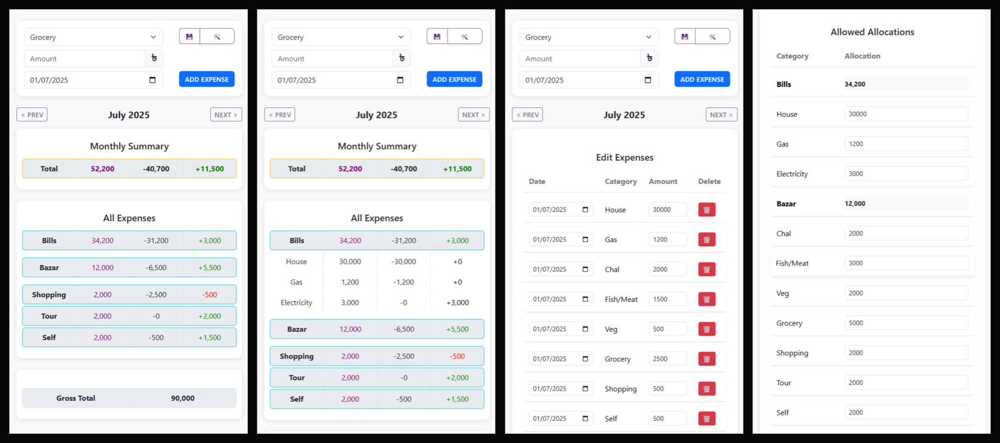

# Expense App

A simple, offline-capable expense tracking application that helps you manage your monthly budgets and expenses.



## Features

- 📊 Track expenses by category (Bills, Bazar, Shopping, etc.)
- 📅 Monthly view with allocation vs. spending comparison
- 💾 Offline functionality with Service Worker caching
- 📱 Progressive Web App (PWA) - installable on mobile devices
- 📈 View historical data and month-to-month comparisons
- 📤 Export data to CSV for backup and analysis
- ✏️ Edit mode for modifying past entries and allocations

## Installation

### Web Version
Simply visit the [live demo](https://tanzimenvst.github.io/expense-app/) in your browser.

### PWA Installation
1. Open the app in Chrome or Edge on your mobile device
2. Tap the "Add to Home Screen" prompt (Android) or share menu → "Add to Home Screen" (iOS)
3. The app will install and launch like a native application

### Local Development
1. Clone this repository
2. Serve the files using a local web server (e.g., `python -m http.server 8000`)
3. Open `http://localhost:8000` in your browser

## Usage

1. **Add Expenses**:
   - Select a category from the dropdown
   - Enter the amount
   - Choose a date (defaults to today)
   - Click "Add Expense"

2. **Navigate Months**:
   - Use the "Prev" and "Next" buttons to switch between months

3. **View Details**:
   - Click on "Bills" or "Bazar" to expand/collapse subcategories
   - Allocation amounts are shown in purple
   - Remaining amounts are color-coded (green = positive, red = negative)

4. **Edit Mode**:
   - Click the wrench (🛠️) icon to enter edit mode
   - Modify expense amounts or dates
   - Adjust monthly allocations
   - Save or cancel your changes

5. **Data Export**:
   - Click the floppy disk (💾) icon to export all data as CSV

## Data Structure

The app stores data in localStorage with this structure:
```json
{
  "YYYY-MM": {
    "allocations": {
      "House": 10000,
      "Gas": 2000,
      "Electricity": 1500
    },
    "expenses": [
      {
        "date": "YYYY-MM-DD",
        "category": "Grocery",
        "amount": 500
      },
      {
        "date": "YYYY-MM-DD",
        "category": "Fish/Meat",
        "amount": 800
      }
    ]
  }
}
```

## Technical Details

- **Frontend**: Vanilla JavaScript with Bootstrap 5 for styling
- **Offline Support**: Service Worker with cache-first strategy
- **PWA**: Web Manifest for installability
- **Data Persistence**: localStorage for all expense data
- **Number Formatting**: Indian/Bangladeshi style (#,##,###)


## Author

Developed by **Tanzim**. Feel free to connect !
